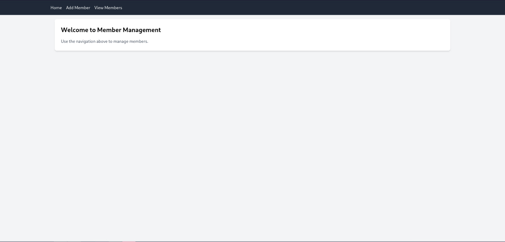
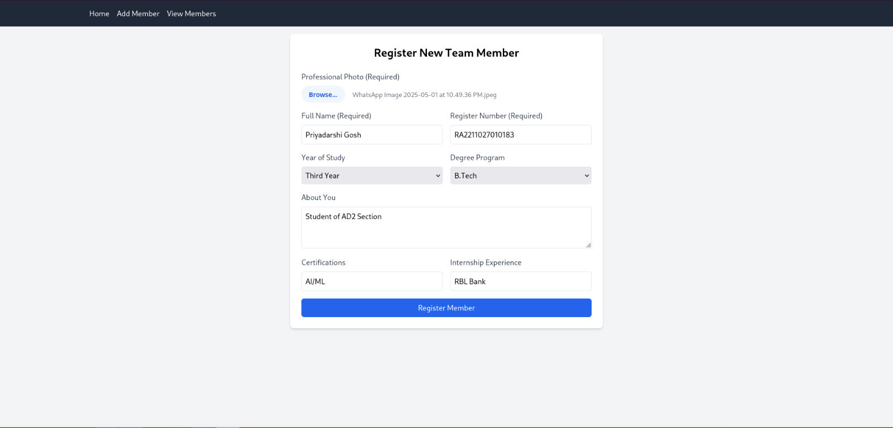
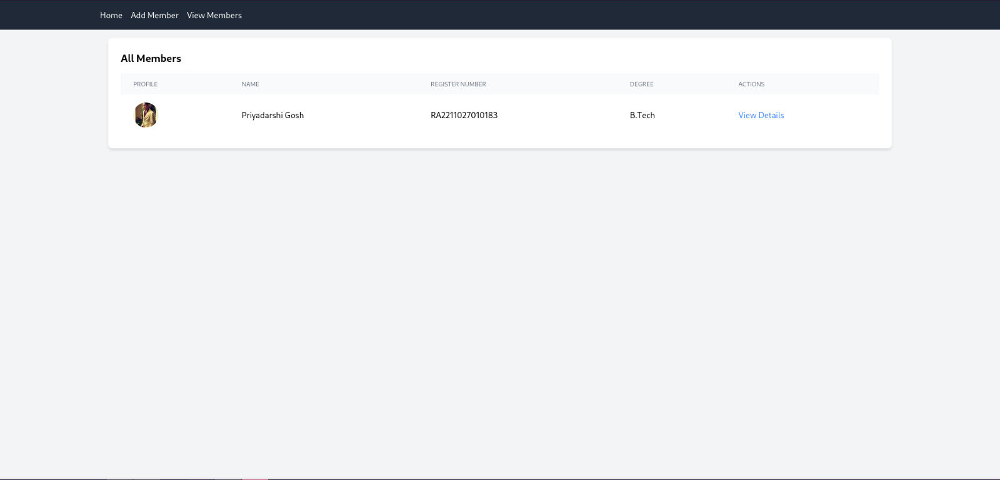
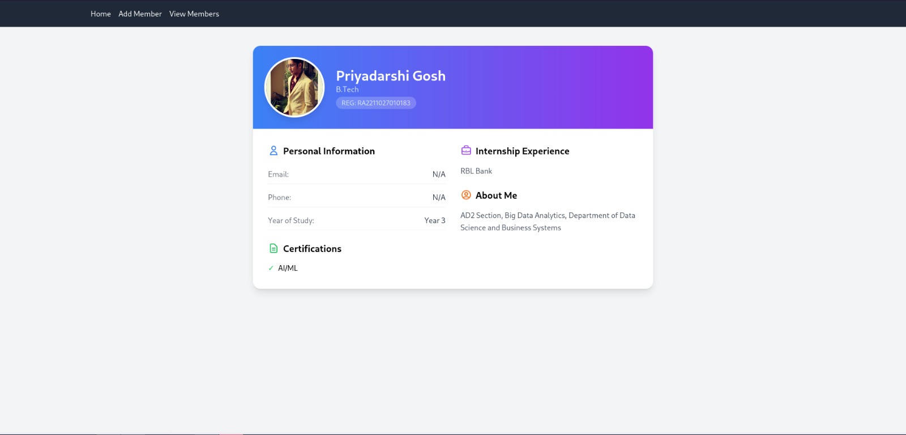

# Team_Management_System

A responsive MERN-stack application to manage student or team member profiles. The system allows users to **add new members** with profile images and key details, and **view all registered members** in a tabular format.

---

## 🚀 Features

### ✅ Add Member
- Upload a profile photo
- Enter full name, register number, year, and degree
- Add optional information like certifications, internships, and a short "about" section

### 👀 View Members
- View a list of all members with their profile image, name, register number, and degree
- Includes a link to view more detailed information for each member (extendable)

---

## 🖼️ Screenshots

### 📌 Home Page

### 📌 Add Member Page

### 📌 View Members Page

### 📌 View Details Page

---

## 🛠️ Tech Stack

- **Frontend**: React.js + Tailwind CSS
- **Backend**: Node.js + Express
- **Database**: MongoDB
- **HTTP Client**: Axios
